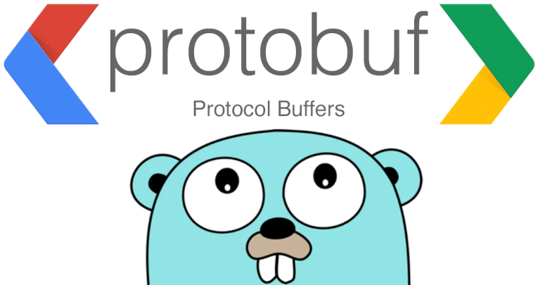

# Game Data

<h2>
<a href="https://medium.com/@homayoonalimohammadi/protoc-plugins-with-go-52a178dbc27a">Link to Medium Post</a>

</h1>

Protocol Buffers (protobuf) have become a popular choice for data serialization and communication between services in the world of modern software development. With their language-agnostic nature, efficiency, and ease of use, protobufs have emerged as a go-to solution for structuring data interchange formats.

While protobufs offer an extensive set of features to define and handle messages, there are times when developers encounter complex scenarios that require additional customization. One such scenario that I personally faced was when I tried to deal with logical and domian specific constraints on the data. Things that can not be forced or even mentioned in a proto file outside of raw comments or loose conventions.

By developing a custom protoc plugin, we can extend the capabilities of the protobuf compiler (protoc) to automatically generate code that makes working with proto messages more intuitive and efficient. In the article below, we will discuss the various components involved in the creation of such a plugin, including the Protobuf Compiler Plugin API, Go’s plugin package, and the necessary steps to integrate a plugin into the protobuf compilation process.

Hope you enjoy!

